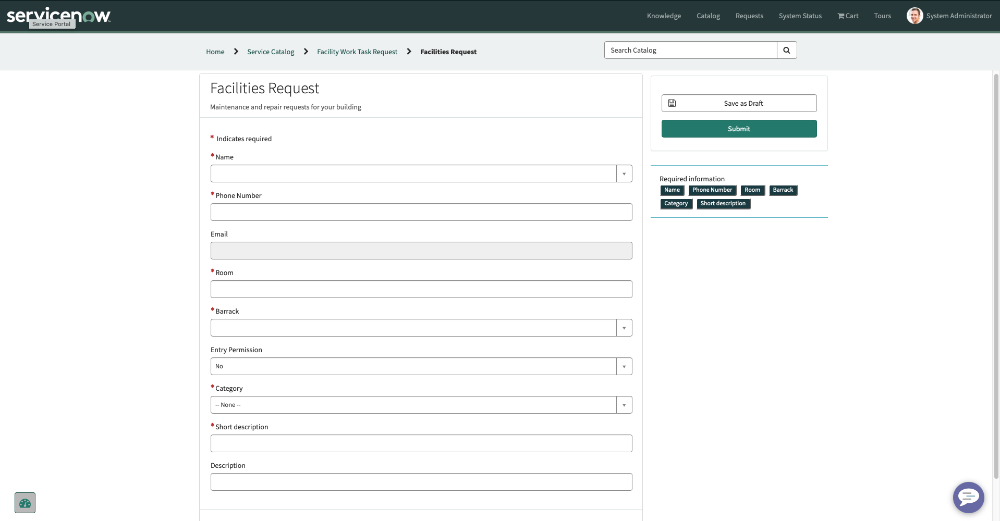

# Facility-Request-App
My team and I developed an application that will allow service members living in the military installations to submit work orders and track them in real time  

## Overview
This ServiceNow application allows users to submit and track work order requests from both desktop and mobile devices. The app provides real-time status updates, automated notifications, and a streamlined approval workflow to ensure requests are handled efficiently.

## My Role
- Contributed to designing the application using ServiceNow App Engine Studio
- Built forms, tables, and catalog items
- Configured some Flow Designer workflows for automated notifications
- Tested and deployed in the ServiceNow dev environment
- Created a QR code to allow users to submit requests from their mobile devices

## Features
- 📩 **Request Submission** – Users can submit work orders via a catalog item
- 🔔 **Notifications** – Automated email and mobile push updates at each stage
- 📱 **Mobile Ready** – Fully responsive design using UI Builder
- 📊 **Status Tracking** – Real-time progress updates
- 🛠 **Admin Dashboard** – For managing and resolving requests

## Architecture & Workflow

## Screenshots
| Desktop View | Mobile View |
|--------------|-------------|
|  |  |

## Lessons Learned
Working on this project improved my skills in:
- ServiceNow Flow Designer
- UI Builder customization
- ServiceNow data modeling
- Agile sprint delivery within tight deadlines
